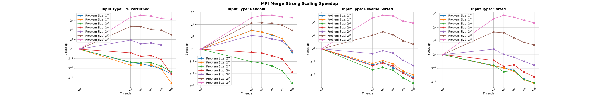
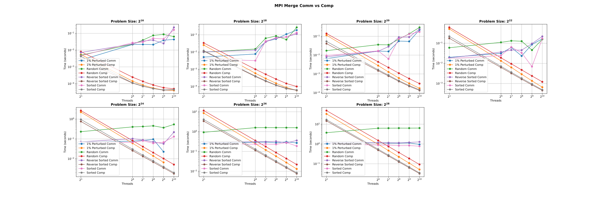
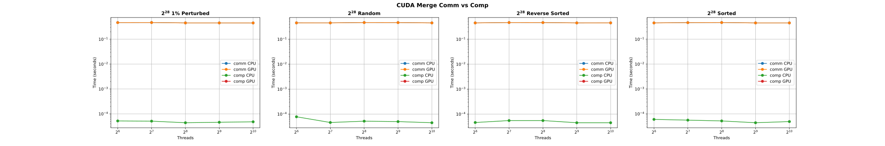
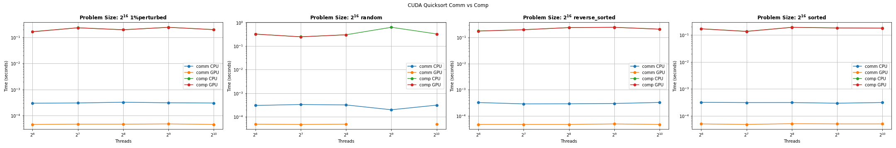
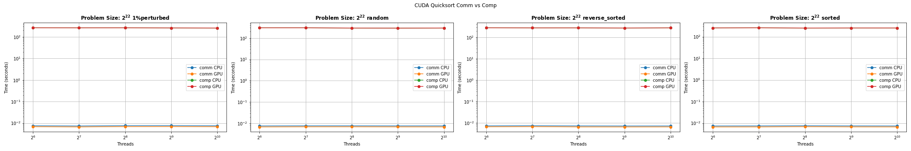
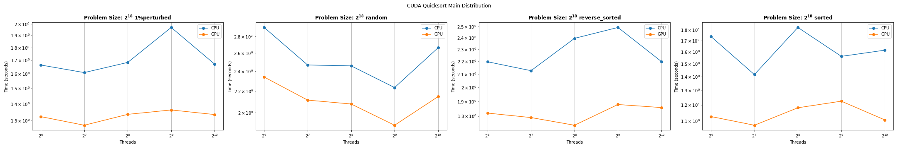
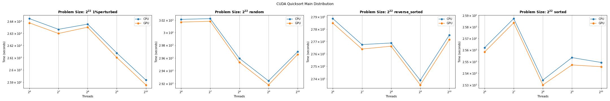
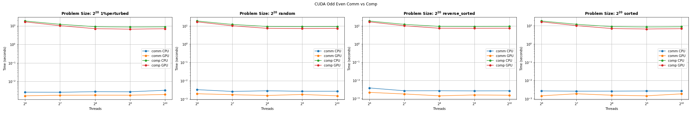
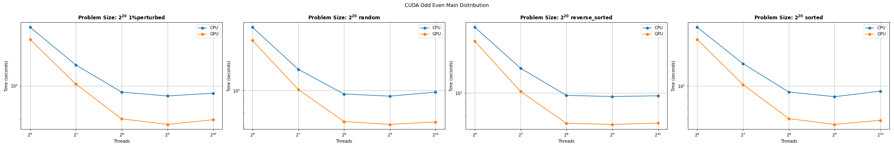

# CSCE 435 Group project

## 0. Group number: 

## 1. Group members:
1. Evan Burriola
2. Min Zhang
3. Cole McAnelly
4. Saddy Khakimova

All communication between team members will be coordinated through Discord.

## 2. Project topic (e.g., parallel sorting algorithms)

### 2a. Brief project description (what algorithms will you be comparing and on what architectures)

For this project we will be comparing the following sorting algortithms:

- Merge sort
- Quick sort
- Bitonic sort
- Odd even sort

Each sorting algorithm will be implemented two ways: MPI and CUDA

### 2b. Pseudocode for each parallel algorithm
- For MPI programs, include MPI calls you will use to coordinate between processes
- For CUDA programs, indicate which computation will be performed in a CUDA kernel,
  and where you will transfer data to/from GPU

**MPI Merge Sort**

```cpp
// 1. Split unsorted array into smaller unsorted portions using scatter
MPI_Scatter(globalArray, localArraySize, MPI_INT, localArray, localArraySize, MPI_INT, 0, MPI_COMM_WORLD);

// 2. Sort the smaller sublists using any sorting algorithm
std::sort(&arr[0], &arr[len - 1]);

// 3. Merge the sorted sublists
//  3a. by sending the sublist to a parent process
MPI_Send(half1, size, MPI_INT, parent, 0, MPI_COMM_WORLD);
//  3b. and by Receiving said sublist from a child and merging them with the parent's list
MPI_Recv(half2, size, MPI_INT, rightChild, 0, MPI_COMM_WORLD, MPI_STATUS_IGNORE);

// 4. Repeat step 3 until the whole tree is traversed
```

**CUDA Merge Sort**

```cpp
int main()
// create unsorted array

// cudaMalloc to allocate VRAM for array

// cudaMemcpy to transfer array to VRAM from RAM

// Kernel code will divide the array, and sort into a new "result" array
MergeSort<<<blocks, threads, sizeof(int) * len*2>>>(values, result, len);

// cudaMemcpy to transfer array from VRAM to RAM

// check if the array is sorted
```

**MPI Quick Sort**

    void swap(float *x, float *y):
        swap two elements in the array

    int partition(float *values, int left, int right):
        partition the array and return the new pivot index
    
    void quicksort(float *values, int left, int right):
        sorts portions of the array between two indices recursively using the quickSort algorithm.

    void quicksort_recursive(float *arr, int left, int right, int currProcRank, int maxRank, int rankIndex):
        handle the recursive sorting and the distribution of work across MPI processes

    int main(&argc,&argv)
        MPI_Init(&argc,&argv);
        MPI_Comm_rank(MPI_COMM_WORLD,&taskid);
        MPI_Comm_size(MPI_COMM_WORLD,&numtasks);

        each process generates sublist

        perform parallel Quicksort on MPI:
        quicksort_recursive(values, 0, offset - 1, taskid, numtasks - 1, rankPower);

        if taskid == 0:
            collect all sublists into the global array
        else:
            send sorted sublist to the root process

        check if the array is sorted

**CUDA Quick Sort**
    int main()
        create unsorted array

        cudaMalloc to allocate memory for array on the GPU

        cudaMemcpy to transfer array to GPU

        perform QuickSort on the GPU
        for (int i = 0; i < NUM_VALS; i++) {
            quicksort<<<BLOCKS, THREADS>>>(dev_values, NUM_VALS);
        }

        cudaDeviceSynchronize to synchronize the device

        cudaMemcpy to transfer sorted array from GPU to host

        check if the array is sorted

**MPI Bitonic Sort**

    void compareExchange(float *values, int length, 
		     int node1, int node2, int biggerFirst,
		     int sequenceNo)

        memcpy(tempArray, numbers, length*sizeof(float));     

        get numbers from the other node. 
        have the process that is node1 always send first, and node2 receive first
        --prevent deadlock

        NODE1:
            MPI_Send(numbers, length, MPI_FLOAT, nodeFrom, sequenceNo, MPI_COMM_WORLD);

            MPI_Recv(&tempArray[length], length, MPI_FLOAT, nodeFrom, sequenceNo, 
	        MPI_COMM_WORLD, &status);
        NODE2 
            MPI_Recv(&tempArray[length], length, MPI_FLOAT, nodeFrom, sequenceNo, 
	        MPI_COMM_WORLD, &status);

            MPI_Send(numbers, length, MPI_FLOAT, nodeFrom, sequenceNo, MPI_COMM_WORLD);
  
        sort ascending/descending 

        keep only respective half


    void bitonic_sort(values, length)

        bitonically dispatch comparisions between 'nodes'

            compareExchange(float *values, int length, 
		     int node1, int node2, int biggerFirst,
		     int sequenceNo);


    int main(&argc,&argv)
        MPI_Init(&argc,&argv);
        MPI_Comm_rank(MPI_COMM_WORLD,&taskid);
        MPI_Comm_size(MPI_COMM_WORLD,&numtasks);

        each process generates sublist

        bitonic_sort(values,length)

        //Gather all values into the global array
        MPI_Gather()

        check if the array is sorted

**CUDA Bitonic Sort**

    int main()
        create unsorted array

        cudaMalloc to allocate memory for array

        cudaMemcpy to transfer array to GPU

        for (int i = 0; i < NUM_VALS; i++) {
            bitonic_sort<<<BLOCKS, THREADS>>>(dev_values, NUM_VALS);
        }

        check if the array is sorted

**MPI Odd Even Sort**

    int main(&argc,&argv)
        MPI_Init(&argc,&argv);
        MPI_Comm_rank(MPI_COMM_WORLD,&taskid);
        MPI_Comm_size(MPI_COMM_WORLD,&numtasks);

        each thread generates sublists

        odd_even_sort(values, offset, taskid, numtasks, MPI_COMM_WORLD)

        if taskid == 0
            MPI_Recv sorted sublist from all other threads
        else
            MPI_Send sorted sublist to master thread

        check if the array is sorted

**CUDA Odd Even Sort**

    int main()
        create unsorted array

        cudaMalloc to allocate memory for array

        cudaMemcpy to transfer array to GPU

        for (int i = 0; i < NUM_VALS; i++) {
            odd_even_sort<<<BLOCKS, THREADS>>>(dev_values, NUM_VALS);
        }

        check if the array is sorted

### 2c. Evaluation plan - what and how will you measure and compare
- Input sizes, Input types
- Strong scaling (same problem size, increase number of processors/nodes)
- Weak scaling (increase problem size, increase number of processors)
- Number of threads in a block on the GPU 

We plan to test our sorting algorithms on 64, 128, and 256, 1024 threads with input of 2^12^, 2^16^, 2^20^, and 2^24^ floats. This will allow us to see the effect of strong scaling by see how the different thread counts across each of the varying input sizes affect performance and weak scaling by seeing how the differnt input sizes across each of the varying thread counts affect performace. In addition for CUDA implementations, the block size is defined as the input size divided by the number of threads.

## 3. Project implementation
Implement your proposed algorithms, and test them starting on a small scale.
Instrument your code, and turn in at least one Caliper file per algorithm;
if you have implemented an MPI and a CUDA version of your algorithm,
turn in a Caliper file for each.

### 3a. Caliper instrumentation
Please use the caliper build `/scratch/group/csce435-f23/Caliper/caliper/share/cmake/caliper` 
(same as lab1 build.sh) to collect caliper files for each experiment you run.

Your Caliper regions should resemble the following calltree
(use `Thicket.tree()` to see the calltree collected on your runs):
```
main
|_ data_init
|_ comm
|    |_ MPI_Barrier
|    |_ comm_small  // When you broadcast just a few elements, such as splitters in Sample sort
|    |   |_ MPI_Bcast
|    |   |_ MPI_Send
|    |   |_ cudaMemcpy
|    |_ comm_large  // When you send all of the data the process has
|        |_ MPI_Send
|        |_ MPI_Bcast
|        |_ cudaMemcpy
|_ comp
|    |_ comp_small  // When you perform the computation on a small number of elements, such as sorting the splitters in Sample sort
|    |_ comp_large  // When you perform the computation on all of the data the process has, such as sorting all local elements
|_ correctness_check
```

Required code regions:
- `main` - top-level main function.
    - `data_init` - the function where input data is generated or read in from file.
    - `correctness_check` - function for checking the correctness of the algorithm output (e.g., checking if the resulting data is sorted).
    - `comm` - All communication-related functions in your algorithm should be nested under the `comm` region.
        - Inside the `comm` region, you should create regions to indicate how much data you are communicating (i.e., `comm_small` if you are sending or broadcasting a few values, `comm_large` if you are sending all of your local values).
        - Notice that auxillary functions like MPI_init are not under here.
    - `comp` - All computation functions within your algorithm should be nested under the `comp` region.
        - Inside the `comp` region, you should create regions to indicate how much data you are computing on (i.e., `comp_small` if you are sorting a few values like the splitters, `comp_large` if you are sorting values in the array).
        - Notice that auxillary functions like data_init are not under here.

All functions will be called from `main` and most will be grouped under either `comm` or `comp` regions, representing communication and computation, respectively. You should be timing as many significant functions in your code as possible. **Do not** time print statements or other insignificant operations that may skew the performance measurements.

**Nesting Code Regions** - all computation code regions should be nested in the "comp" parent code region as following:
```
CALI_MARK_BEGIN("comp");
CALI_MARK_BEGIN("comp_large");
mergesort();
CALI_MARK_END("comp_large");
CALI_MARK_END("comp");
```

**Looped GPU kernels** - to time GPU kernels in a loop:
```
### Bitonic sort example.
int count = 1;
CALI_MARK_BEGIN("comp");
CALI_MARK_BEGIN("comp_large");
int j, k;
/* Major step */
for (k = 2; k <= NUM_VALS; k <<= 1) {
    /* Minor step */
    for (j=k>>1; j>0; j=j>>1) {
        bitonic_sort_step<<<blocks, threads>>>(dev_values, j, k);
        count++;
    }
}
CALI_MARK_END("comp_large");
CALI_MARK_END("comp");
```

**Calltree Examples**:

```
# Bitonic sort tree - CUDA looped kernel
1.000 main
├─ 1.000 comm
│  └─ 1.000 comm_large
│     └─ 1.000 cudaMemcpy
├─ 1.000 comp
│  └─ 1.000 comp_large
└─ 1.000 data_init
```

```
# Matrix multiplication example - MPI
1.000 main
├─ 1.000 comm
│  ├─ 1.000 MPI_Barrier
│  ├─ 1.000 comm_large
│  │  ├─ 1.000 MPI_Recv
│  │  └─ 1.000 MPI_Send
│  └─ 1.000 comm_small
│     ├─ 1.000 MPI_Recv
│     └─ 1.000 MPI_Send
├─ 1.000 comp
│  └─ 1.000 comp_large
└─ 1.000 data_init
```

```
# Mergesort - MPI
1.000 main
├─ 1.000 comm
│  ├─ 1.000 MPI_Barrier
│  └─ 1.000 comm_large
│     ├─ 1.000 MPI_Gather
│     └─ 1.000 MPI_Scatter
├─ 1.000 comp
│  └─ 1.000 comp_large
└─ 1.000 data_init
```

#### 3b. Collect Metadata

Have the following `adiak` code in your programs to collect metadata:
```
adiak::init(NULL);
adiak::launchdate();    // launch date of the job
adiak::libraries();     // Libraries used
adiak::cmdline();       // Command line used to launch the job
adiak::clustername();   // Name of the cluster
adiak::value("Algorithm", algorithm); // The name of the algorithm you are using (e.g., "MergeSort", "BitonicSort")
adiak::value("ProgrammingModel", programmingModel); // e.g., "MPI", "CUDA", "MPIwithCUDA"
adiak::value("Datatype", datatype); // The datatype of input elements (e.g., double, int, float)
adiak::value("SizeOfDatatype", sizeOfDatatype); // sizeof(datatype) of input elements in bytes (e.g., 1, 2, 4)
adiak::value("InputSize", inputSize); // The number of elements in input dataset (1000)
adiak::value("InputType", inputType); // For sorting, this would be "Sorted", "ReverseSorted", "Random", "1%perturbed"
adiak::value("num_procs", num_procs); // The number of processors (MPI ranks)
adiak::value("num_threads", num_threads); // The number of CUDA or OpenMP threads
adiak::value("num_blocks", num_blocks); // The number of CUDA blocks 
adiak::value("group_num", group_number); // The number of your group (integer, e.g., 1, 10)
adiak::value("implementation_source", implementation_source) // Where you got the source code of your algorithm; choices: ("Online", "AI", "Handwritten").
```

They will show up in the `Thicket.metadata` if the caliper file is read into Thicket.

**See the `Builds/` directory to find the correct Caliper configurations to get the above metrics for CUDA, MPI, or OpenMP programs.** They will show up in the `Thicket.dataframe` when the Caliper file is read into Thicket.

## 4. Performance evaluation

Include detailed analysis of computation performance, communication performance. 
Include figures and explanation of your analysis.

### 4a. Vary the following parameters
For inputSizes:
- 2^16, 2^18, 2^20, 2^22, 2^24, 2^26, 2^28

For inputTypes:
- Sorted, Random, Reverse sorted, 1%perturbed

num_procs, num_threads:
- MPI: num_procs:
    - 2, 64, 128, 256, 512, 1024
- CUDA: num_threads:
    - 64, 128, 256, 512, 1024

This should result in 7x4x6=168 Caliper files for your MPI experiments.

### 4b. Hints for performance analysis

To automate running a set of experiments, parameterize your program.

- inputType: If you are sorting, "Sorted" could generate a sorted input to pass into your algorithms
- algorithm: You can have a switch statement that calls the different algorithms and sets the Adiak variables accordingly
- num_procs:   How many MPI ranks you are using
- num_threads: Number of CUDA or OpenMP threads

When your program works with these parameters, you can write a shell script 
that will run a for loop over the parameters above (e.g., on 64 processors, 
perform runs that invoke algorithm2 for Sorted, ReverseSorted, and Random data).  

### 4c. You should measure the following performance metrics
- `Time`
    - Min time/rank
    - Max time/rank
    - Avg time/rank
    - Total time
    - Variance time/rank
    - `If GPU`:
        - Avg GPU time/rank
        - Min GPU time/rank
        - Max GPU time/rank
        - Total GPU time

`Intel top-down`: For your CPU-only experiments on the scale of a single node, you should
generate additional performance data, measuring the hardware counters on the CPU. This can be done by adding `topdown.all` to the `spot()` options in the `CALI_CONFIG` in your jobfile.

## 5. Presentation

Plots for the presentation should be as follows:
- For each implementation:
    - For each of comp_large, comm, and main:
        - Strong scaling plots for each InputSize with lines for InputType (7 plots - 4 lines each)
        - Strong scaling speedup plot for each InputType (4 plots)
        - Weak scaling plots for each InputType (4 plots)

Analyze these plots and choose a subset to present and explain in your presentation.

**MPI Merge Sort**


From the strong scaling plots for the MPI implementation of merge sort, we can see that generally for smaller problem sizes increasing the number of processes will increase the runtime of the program. However, once we get to larger data set sizes, like $2^{24}$ and up, we can see that adding processors can help runtime, but has a trade off. The sweet spot typically sits around $2^6 - 2^7$, after which the runtime begins to increase again. This is certainly intresting and highlights the amount of communication that occurs during an algorithm like MergeSort. 



The strong scaling speedup plots allow us to observe that the MPI implementation of merge sort performs well with more threads for larger problem sizes like $2^{26}$ and $2^{28}$, while smaller problem sizes are negatively effected. This mirrors our conclusions made from the Strong Scaling plots, that "for smaller problem sizes increasing the number of processes will increase the runtime of the program". This is also highlighted by the "sweet-spot" on larger data set sizes being in the $2^6 - 2^7$ region, as we can see that sweet-spot on these Speedup graphs as well.


For weak scaling, we can see that our implementation of MPI Merge Sort does not scale well for large or small "jobs per thread", as both trends are near linear. This implies that a redesign of the implementation is needed, or simply put—merge sort is not the optimal sorting algorithm for something like MPI, requiring too much inter-process communication to be viable.



The communication vs computation graphs for the MPI Merge sort implementation really help the reader understand the afflictions of our MPI merge sort. One can clearly observe the downward trend of the computation graphs, showing that as the work is divided, the program spends less time computing, which is good. However, in contrast, the communication trends are linear in the opposite direciton, clearly showing the biggest problem with MPI Merge sort, as it spends too much time communicating.

**CUDA Merge Sort**


The Strong Scaling plots for our CUDA implementation of Merge sort allow us to come to interesting realizations relating to our algorithm. For the smallest data set sizes, we can see that the algorithm is benefitted by increasing the number of threads, while for the large data set sizes, the runtime is largely unnafected. This is certainly interesting and will require more information, hopefully provided by the speedup graphs.


These speedup graphs allow us to understand that the smaller data set sizes truly benefit much more from larger numbers of threads than than the larger dataset sizes do. This might be an indication that the algorithm does not scale well, but we would need to look at the weak scaling graphs to make those determinations.


The weak scaling graphs do allow us to determine that for small data set sizes, the algorithm definitely scales well, but for larger data set size the trend is near linear indicating that the algorithm does not scale well for larger data set sizes.





These plots allow us to understand where our algorithm is spending more time, and we can clearly see that our algorithm is very effecient. Regardless of data set size, the communication is consistently several orders of magnitude higher than the computation, both for the CPU and the GPU. This is not due to a large amount of time communicating, as there was 1 communication to and from the GPU (cudaMemcpy), but rather due to the high efficiency of the GPU sorting algorithm.


These CPU vs GPU graphs only further corroborate the speed of the GPU sorting algorithm, as the CPU was consistently timed taking much more time than the GPU. This is most likely due to setup, allocation, communication, deallocation, and correctness checking all taking place on the CPU, while the GPU was simply sorting.

**MPI Quick Sort**


Based on the strong scaling plots for the MPI quicksort, we can see that we with the smal number of threads (with $2^{4}$), the runtime descreases as we use more threads. This shows that the algorithm is benefiting from parallelism. After certain number of threads, the runtime starts to plateau or even increase, which sugests that the overhead of synchronization and communication is outweighting the benefits of parallelism. With the larger problem siuze, the overhead behavior becomes more pronounced. For example, with problem size $2^{28}$, the time descreases uo to $2^{7}$, then it increases again. The behavior of different input types also have different affect on parallelism. For a sorted or reverse sorted arrays, the runtime increases significantly. Overall, we can observe that while MPI can reduce runtime for quicksort for certain problem sizes and thread counts, there is a limit to benefit of parallelization. 


Analyzing these graphs, we can see a clear peak in speedup which suggests an optimal number of threads for each problem size. After reaching the peak, the addition of more threads leads to a decrease in speedup, meaning the overhead is becoming dominant. We see that the larger the problem size, the higher the potential speedup. However, it is diffeernt for different numbers of threads. For random input, it seems to benefit more consistently from the increased number of threads across all problem sizes, where the speedup increasing before it peaks and then declines, which shows it works well in parallel. For sorted input and reverse sorted input, it shows a quick gain in speedup that peaks and then decreases sharply with more threads, which could be due to the difficulty of dividing the work evenly among threads. For 1% perturbed, there is an optimal number of threads for where overhead is minumal. 


For weak scaling, we see that it i s better for smaller workloads like 1024 jobs per thread across all input sizes. This could be due to the communication overhead. For larger workload, the weak scaling is generally poor. The execution times increases as we use more threads. This could be be because the larger dataset size per thread increases the complexity of the sorting operation, which causes higher communication costs and not all threads are being used. 


For comm vs comp graph, as the number of threads increases, computation time decreases due to parallel processing gains, but communication time increases due to the overhead and synchronization among threads. We can say that adding threads is beneficial to a certain extent. With larger problem sizes, the communication starts to dominate the total time. 1% perturbed and random inputs show more uniform communication patterns compared to sorted or reverse_sorted inputs. 

**CUDA Quick Sort**


I would like to note that my algorithm was only able to scale it til problem size of 2^22 only for CUDA. 
From the strong scaling plots, the execution time decreases with the addition of more threads for larger problem sizes, which shows the effective parallelization. However, there is a threshold where adding more threads ceases to benefit and can even hinder performance. This could be due to the overheads which limit the parallelism. For smaller problem sizes, the execution time shows inconsistent behavior, which suggests that the overhead of parallelization negates the benefits when the dataset is not sufficiently large. 


Looking at the graphs, it show that speedup increases with more threads to a point, after which it plateaus or decreases, indicating an optimal parallelism threshold. The trend varies across different input types, suggesting that data arrangement affects the efficiency gains from parallel processing.


The weak scaling graphs show a rise in execution time for both workload scenarios, with a steeper increase for the higher workload (4096 jobs per thread). This menans that as the complexity of the problem grows, the overhead in parallel processing become more pronounced. This is a consistent trend across different data types.







The graphs suggest a consistent trend: computation time on the GPU remains significantly lower than on the CPU across all problem sizes, highlighting the computational efficiency of the GPU. Also, communication time is generally higher on the GPU than the CPU, which indicates the overhead associated with data transfer between host and device. This trend is the same regardless of the data size, which shows the importance of optimizing data transfer to observe GPU acceleration in CUDA applications.






Based on the graphs, there's a clear trend that the GPU consistently outperforms the CPU in execution time across all data sizes and types. The performance gain of the GPU is more pronounced as the problem size increases, demonstrating the better scalability of parallel processing on the GPU. However, for certain thread configurations, we see spikes in GPU execution time. This could mean  that there are optimal thread counts for different problem sizes. 

**MPI Bitonic Sort**


Looking at the strong scaling graphs, we can see that for fixed problem sizes, increasing the problem size generally improves performance up to a point. That breaking point seems to be at $2^{8}$ threads at the smaller problem sizes and $2^{9}$ at the largest sizes. This difference could likely be attributed to the balance required to have enough work to occupy all of the processes and minimize idle time. Additionally, it can be generally noted that the reverse sorted sorts performed extremely well with only 2 processes at most of the problem sizes. This indicates that the communication overhead in the implementation needs much more optimization to sort these kinds of lists efficiently with parallelism. However, it is to be noted that at the largest problem size, we see the best representation of strong scaling. This shows that the algorithm strong scales well across all input types at very large problem sizes, which is very good to see!


The speedup is the greatest at the largest problem size across all input types. This is in line with our analysis of the strong scaling graphs. For the largest problem size, we can see that the speedup is at the maximum generally at $2^{9}$ or $2^{8}$ before falling off at $2^{10}$. An interesting insight can be seen between the input types. The only input type that had a positive speedup trend for all problem sizes is the random input. Additionally the speedup found here was of the largest magnitude. For the other input types, there seems to be a problem size threshold needed in order to gain a positive trend in the speedup as the processes increase.


Looking at weak scaling, we see a general tend towards performance increase moving from $2^{6}$ to $2^{8}$ processes at both the largest problem size and smallest. However we see a sharp decrease in performance as we move to $2^{10}$ processes for both the largest and smallest problem sizes. This seems to be the limit for this implementation


Analyzing the communication vs. computation graphs we can see that computation consumes more time across the board. There isn't a point where communication takes more time than the actual computation. Additionally we don't see a convincing total positive performance increase from process size increase until we get to the larger problem sizes (starting at $2^{24}$). We can see the best trend in performance increase as process size increases at the problem size $2^{28}$ up until the $2^{10}$ processes point.


**CUDA Bitonic Sort**


In the smaller problem sizes, we see that as the thread count increases, performance increases up to about the $2^{8}$ point. In the larget problem sizes, the performance increases futher to around the $2^{9}$ point.Generally speaking, the program scales well as the thread count increases with constant problem sizes. Additionally, it should be noted that the random input type generally performs much worse than the other input types.


For nearly all problem sizes on every input type, we see a positive strong scaling speedup. These graphs show confidently that the algorithm scales strongly. Additionally, the largest problem size generally represents the largest magnitude of speedup for each input type.


Looking at the weak scaling of the algorithm, it scales extremely well at the lowest problem size, as it looks nearly constant. However, the largest problem size doesn't show as optimal behavior as the lower problem size. This would indicate that the largest problem size passes the optimal 'saturation' state of the GPU as we don't see the optimal behavior at this problem size.


Across the board we can see that most of the runtime is being consumed in the computation phase. Communication takes a small fraction of the time in comparison to the computation. Additionally, the computation being performed on the CPU is taking the greatest amount of time. This is likely at the cudaDeviceSynchronize() call that requires a certain amount of idling as the resources synchronize.


We can see the previous point reflected in the CPU vs GPU time. The CPU is consuming much more time and decreasing the performance of the algorithm much more than the GPU. Additionally, the verification step is performed entirely on the CPU and can be a major reason as to why the CPU is consuming so much time.

**MPI Odd Even Sort**


From the strong scaling plots for the MPI implementation of odd even sort, we can see that for extremely large problem size, $2^{26}$ and above we see a decrease in the runtime with use of more threads. However this descrease in run time plateus and changes to be an increase in run time after $2^6$ threads. This is more than likely caused by the problem size not being big enough for the parallelization benefits of using more threads to outweigh the overhead of parallelization to include cost of communication among all the threads. For smaller problem sizes, the use of more threads leads to an increase in run time rather than a decrease because the overhead cost of parallelization and communication costs among all the threads outweigh the performance increase associated with the use of more threads.


In terms of strong scaling speedup we can see that the MPI implementation of odd even sort receives predominantly has an increased speedup for more threads for larger problem size like $2^{26}$ and $2^{28}$, that will also decrease for larger number of threads. For smaller problem size the speedup associated with the use of more threads is not present and instead the increase number of threads caused a decreasing speedup. This is reflective of the information gathered from the strong scaling plots as for smaller problem size the use of more threads causes an increase in runtime and for larger problem sizes there is a time decrease associated with more threads to a point before it begins to instead affect the run time performace negatively.


For weak scaling, we can see that the MPI implementation of odd even sort appears to weak sort relatively well for 1024 jobs per thread for sorted and random input types as the ploted line is near horizontal. However for larger number of jobs and for the other input types the MPI odd even sort implementation does not scale well in terms of weak scaling as the lines are linearly increasing, rather than remaining constant/horizontal.


From the graphs on the time distribution spent in communication and computation, we can see that the program predominantly spends time doing computation rather than communication. The computation times and communication times for smaller problem sizes increase with the use of more threads, while for larger input types, the communication times appear to remain relatively constant, while the computation times decrease then plateau with the use of more threads.

**CUDA Odd Even Sort**


From the strong scaling plots for the CUDA implementation of odd even sort, we can see that for larger problem sizes, $2^{18}$ and above we see a significant decrease in runtime with the use of more threads. However this decrease in run time plateus and changes to be an increase in run time after $2^8$ threads. This is more than likely caused by the problem size not being big enough for the parallelization benefits of using more threads to outweigh the overhead of parallelization. In addition for smaller problem sizes like $2^{16}$, the run times appear to be random/erraneous because the problem size is too small to see any significant time benefits with paralleization as the overhead outweighs a majority of the benefits.


The CUDA implemenation of odd even sort, receives the most about of speedup with regards to strong scaling for larger problem sizes. For smaller problem size the strong scaling speedup with the use of more threads is increasing but a a much smaller scale than for larger problem sizes. In addition across all the problem size available in the CUDA implementation, they receive a better speed up than the MPI implementation of odd even sort.


In terms of weak scaling, the CUDA implementation of odd even sort does not scale well as none of the plotted lines are horizontal.





From looking at the distribution between the between the time spent doing computation and communication, we can see that the CUDA implemenation of odd even sort spends a majority of time doing computation. For larger problem sizes, the computation time decreases then plateaus with the use of more threads. Regardless of problem size, the communication times remain constant regardless of the number of threads. With the communication on the CPU taking longer than the GPU, however with the larger problem sizes, the difference between the communication time on the CPU and GPU decreases.





From the distributation of time spent on the CPU and GPU, we can gather that a majority of the time is spent on the CPU side. This dominance of the CPU in the run time is understandable as the CPU has to communicate with the GPU then wait for the GPU to perform computations for sorting then communicate the values back. For larger problem sizes, $2^{18}$ and above, we see that with more threads the GPU gains a decreased runtime, which in turn also leads to a decrease CPU runtime. Hoever for the smallest problem size, there appears to not be enough operations to satisfy the GPU to cause a decrease in runtime with the use of more threads.

**MPI Team Comparison**


For the MPI implementations, we see that quicksort performs the best regardless of problem size and thread count. This is then followed up by odd even, then merge, and finally bitonic. However quicksort appears to hit the limit where more threads cause an increase in run time much faster than the other 3 algorithms.

**CUDA Team Comparison**


From comparing the strong scaling performance of the CUDA implementations of bitonic, odd even, merge, and quick sort on random inputs, we can see that merge and bitonic sorts perform the best. For larger problem sizes we can see that odd even sort will have slightly better performance with the use of more threads, while quicksort has a consistant runtime regardless of the number of threads. Merge sort appears to perform the best and its line is just slightly underneath the line for bitonic sort.

## 6. Final Report
Submit a zip named `TeamX.zip` where `X` is your team number. The zip should contain the following files:
- Algorithms: Directory of source code of your algorithms.
- Data: All `.cali` files used to generate the plots seperated by algorithm/implementation.
- Jupyter notebook: The Jupyter notebook(s) used to generate the plots for the report.
- Report.md