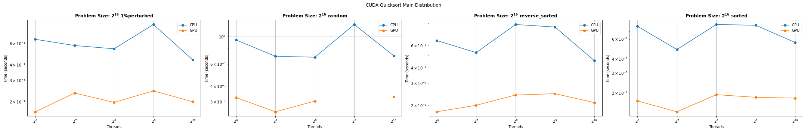

# CSCE 435 Group project

## 0. Group number: 

## 1. Group members:
1. Evan Burriola
2. Min Zhang
3. Cole McAnelly
4. Saddy Khakimova

All communication between team members will be coordinated through Discord.

## 2. Project topic (e.g., parallel sorting algorithms)

### 2a. Brief project description (what algorithms will you be comparing and on what architectures)

For this project we will be comparing the following sorting algortithms:

- Merge sort
- Quick sort
- Bitonic sort
- Odd even sort

Each sorting algorithm will be implemented two ways: MPI and CUDA

### 2b. Pseudocode for each parallel algorithm
- For MPI programs, include MPI calls you will use to coordinate between processes
- For CUDA programs, indicate which computation will be performed in a CUDA kernel,
  and where you will transfer data to/from GPU

**MPI Merge Sort**

```cpp
// 1. Split unsorted array into smaller unsorted portions using scatter
MPI_Scatter(globalArray, localArraySize, MPI_INT, localArray, localArraySize, MPI_INT, 0, MPI_COMM_WORLD);

// 2. Sort the smaller sublists using any sorting algorithm
std::sort(&arr[0], &arr[len - 1]);

// 3. Merge the sorted sublists
//  3a. by sending the sublist to a parent process
MPI_Send(half1, size, MPI_INT, parent, 0, MPI_COMM_WORLD);
//  3b. and by Receiving said sublist from a child and merging them with the parent's list
MPI_Recv(half2, size, MPI_INT, rightChild, 0, MPI_COMM_WORLD, MPI_STATUS_IGNORE);

// 4. Repeat step 3 until the whole tree is traversed
```

**CUDA Merge Sort**

```cpp
int main()
// create unsorted array

// cudaMalloc to allocate VRAM for array

// cudaMemcpy to transfer array to VRAM from RAM

// Kernel code will divide the array, and sort into a new "result" array
MergeSort<<<blocks, threads, sizeof(int) * len*2>>>(values, result, len);

// cudaMemcpy to transfer array from VRAM to RAM

// check if the array is sorted
```

**MPI Quick Sort**

    void swap(float *x, float *y):
        swap two elements in the array

    int partition(float *values, int left, int right):
        partition the array and return the new pivot index
    
    void quicksort(float *values, int left, int right):
        sorts portions of the array between two indices recursively using the quickSort algorithm.

    void quicksort_recursive(float *arr, int left, int right, int currProcRank, int maxRank, int rankIndex):
        handle the recursive sorting and the distribution of work across MPI processes

    int main(&argc,&argv)
        MPI_Init(&argc,&argv);
        MPI_Comm_rank(MPI_COMM_WORLD,&taskid);
        MPI_Comm_size(MPI_COMM_WORLD,&numtasks);

        each process generates sublist

        perform parallel Quicksort on MPI:
        quicksort_recursive(values, 0, offset - 1, taskid, numtasks - 1, rankPower);

        if taskid == 0:
            collect all sublists into the global array
        else:
            send sorted sublist to the root process

        check if the array is sorted

**CUDA Quick Sort**
    int main()
        create unsorted array

        cudaMalloc to allocate memory for array on the GPU

        cudaMemcpy to transfer array to GPU

        perform QuickSort on the GPU
        for (int i = 0; i < NUM_VALS; i++) {
            quicksort<<<BLOCKS, THREADS>>>(dev_values, NUM_VALS);
        }

        cudaDeviceSynchronize to synchronize the device

        cudaMemcpy to transfer sorted array from GPU to host

        check if the array is sorted

**MPI Bitonic Sort**

    void compareExchange(float *values, int length, 
		     int node1, int node2, int biggerFirst,
		     int sequenceNo)

        memcpy(tempArray, numbers, length*sizeof(float));     

        get numbers from the other node. 
        have the process that is node1 always send first, and node2 receive first
        --prevent deadlock

        NODE1:
            MPI_Send(numbers, length, MPI_FLOAT, nodeFrom, sequenceNo, MPI_COMM_WORLD);

            MPI_Recv(&tempArray[length], length, MPI_FLOAT, nodeFrom, sequenceNo, 
	        MPI_COMM_WORLD, &status);
        NODE2 
            MPI_Recv(&tempArray[length], length, MPI_FLOAT, nodeFrom, sequenceNo, 
	        MPI_COMM_WORLD, &status);

            MPI_Send(numbers, length, MPI_FLOAT, nodeFrom, sequenceNo, MPI_COMM_WORLD);
  
        sort ascending/descending 

        keep only respective half


    void bitonic_sort(values, length)

        bitonically dispatch comparisions between 'nodes'

            compareExchange(float *values, int length, 
		     int node1, int node2, int biggerFirst,
		     int sequenceNo);


    int main(&argc,&argv)
        MPI_Init(&argc,&argv);
        MPI_Comm_rank(MPI_COMM_WORLD,&taskid);
        MPI_Comm_size(MPI_COMM_WORLD,&numtasks);

        each process generates sublist

        bitonic_sort(values,length)

        //Gather all values into the global array
        MPI_Gather()

        check if the array is sorted

**CUDA Bitonic Sort**

    int main()
        create unsorted array

        cudaMalloc to allocate memory for array

        cudaMemcpy to transfer array to GPU

        for (int i = 0; i < NUM_VALS; i++) {
            bitonic_sort<<<BLOCKS, THREADS>>>(dev_values, NUM_VALS);
        }

        check if the array is sorted

**MPI Odd Even Sort**

    int main(&argc,&argv)
        MPI_Init(&argc,&argv);
        MPI_Comm_rank(MPI_COMM_WORLD,&taskid);
        MPI_Comm_size(MPI_COMM_WORLD,&numtasks);

        each thread generates sublists

        odd_even_sort(values, offset, taskid, numtasks, MPI_COMM_WORLD)

        if taskid == 0
            MPI_Recv sorted sublist from all other threads
        else
            MPI_Send sorted sublist to master thread

        check if the array is sorted

**CUDA Odd Even Sort**

    int main()
        create unsorted array

        cudaMalloc to allocate memory for array

        cudaMemcpy to transfer array to GPU

        for (int i = 0; i < NUM_VALS; i++) {
            odd_even_sort<<<BLOCKS, THREADS>>>(dev_values, NUM_VALS);
        }

        check if the array is sorted

### 2c. Evaluation plan - what and how will you measure and compare
- Input sizes, Input types
- Strong scaling (same problem size, increase number of processors/nodes)
- Weak scaling (increase problem size, increase number of processors)
- Number of threads in a block on the GPU 

We plan to test our sorting algorithms on 64, 128, and 256, 1024 threads with input of 2^12^, 2^16^, 2^20^, and 2^24^ floats. This will allow us to see the effect of strong scaling by see how the different thread counts across each of the varying input sizes affect performance and weak scaling by seeing how the differnt input sizes across each of the varying thread counts affect performace. In addition for CUDA implementations, the block size is defined as the input size divided by the number of threads.

## 3. Project implementation
Implement your proposed algorithms, and test them starting on a small scale.
Instrument your code, and turn in at least one Caliper file per algorithm;
if you have implemented an MPI and a CUDA version of your algorithm,
turn in a Caliper file for each.

### 3a. Caliper instrumentation
Please use the caliper build `/scratch/group/csce435-f23/Caliper/caliper/share/cmake/caliper` 
(same as lab1 build.sh) to collect caliper files for each experiment you run.

Your Caliper regions should resemble the following calltree
(use `Thicket.tree()` to see the calltree collected on your runs):
```
main
|_ data_init
|_ comm
|    |_ MPI_Barrier
|    |_ comm_small  // When you broadcast just a few elements, such as splitters in Sample sort
|    |   |_ MPI_Bcast
|    |   |_ MPI_Send
|    |   |_ cudaMemcpy
|    |_ comm_large  // When you send all of the data the process has
|        |_ MPI_Send
|        |_ MPI_Bcast
|        |_ cudaMemcpy
|_ comp
|    |_ comp_small  // When you perform the computation on a small number of elements, such as sorting the splitters in Sample sort
|    |_ comp_large  // When you perform the computation on all of the data the process has, such as sorting all local elements
|_ correctness_check
```

Required code regions:
- `main` - top-level main function.
    - `data_init` - the function where input data is generated or read in from file.
    - `correctness_check` - function for checking the correctness of the algorithm output (e.g., checking if the resulting data is sorted).
    - `comm` - All communication-related functions in your algorithm should be nested under the `comm` region.
        - Inside the `comm` region, you should create regions to indicate how much data you are communicating (i.e., `comm_small` if you are sending or broadcasting a few values, `comm_large` if you are sending all of your local values).
        - Notice that auxillary functions like MPI_init are not under here.
    - `comp` - All computation functions within your algorithm should be nested under the `comp` region.
        - Inside the `comp` region, you should create regions to indicate how much data you are computing on (i.e., `comp_small` if you are sorting a few values like the splitters, `comp_large` if you are sorting values in the array).
        - Notice that auxillary functions like data_init are not under here.

All functions will be called from `main` and most will be grouped under either `comm` or `comp` regions, representing communication and computation, respectively. You should be timing as many significant functions in your code as possible. **Do not** time print statements or other insignificant operations that may skew the performance measurements.

**Nesting Code Regions** - all computation code regions should be nested in the "comp" parent code region as following:
```
CALI_MARK_BEGIN("comp");
CALI_MARK_BEGIN("comp_large");
mergesort();
CALI_MARK_END("comp_large");
CALI_MARK_END("comp");
```

**Looped GPU kernels** - to time GPU kernels in a loop:
```
### Bitonic sort example.
int count = 1;
CALI_MARK_BEGIN("comp");
CALI_MARK_BEGIN("comp_large");
int j, k;
/* Major step */
for (k = 2; k <= NUM_VALS; k <<= 1) {
    /* Minor step */
    for (j=k>>1; j>0; j=j>>1) {
        bitonic_sort_step<<<blocks, threads>>>(dev_values, j, k);
        count++;
    }
}
CALI_MARK_END("comp_large");
CALI_MARK_END("comp");
```

**Calltree Examples**:

```
# Bitonic sort tree - CUDA looped kernel
1.000 main
├─ 1.000 comm
│  └─ 1.000 comm_large
│     └─ 1.000 cudaMemcpy
├─ 1.000 comp
│  └─ 1.000 comp_large
└─ 1.000 data_init
```

```
# Matrix multiplication example - MPI
1.000 main
├─ 1.000 comm
│  ├─ 1.000 MPI_Barrier
│  ├─ 1.000 comm_large
│  │  ├─ 1.000 MPI_Recv
│  │  └─ 1.000 MPI_Send
│  └─ 1.000 comm_small
│     ├─ 1.000 MPI_Recv
│     └─ 1.000 MPI_Send
├─ 1.000 comp
│  └─ 1.000 comp_large
└─ 1.000 data_init
```

```
# Mergesort - MPI
1.000 main
├─ 1.000 comm
│  ├─ 1.000 MPI_Barrier
│  └─ 1.000 comm_large
│     ├─ 1.000 MPI_Gather
│     └─ 1.000 MPI_Scatter
├─ 1.000 comp
│  └─ 1.000 comp_large
└─ 1.000 data_init
```

#### 3b. Collect Metadata

Have the following `adiak` code in your programs to collect metadata:
```
adiak::init(NULL);
adiak::launchdate();    // launch date of the job
adiak::libraries();     // Libraries used
adiak::cmdline();       // Command line used to launch the job
adiak::clustername();   // Name of the cluster
adiak::value("Algorithm", algorithm); // The name of the algorithm you are using (e.g., "MergeSort", "BitonicSort")
adiak::value("ProgrammingModel", programmingModel); // e.g., "MPI", "CUDA", "MPIwithCUDA"
adiak::value("Datatype", datatype); // The datatype of input elements (e.g., double, int, float)
adiak::value("SizeOfDatatype", sizeOfDatatype); // sizeof(datatype) of input elements in bytes (e.g., 1, 2, 4)
adiak::value("InputSize", inputSize); // The number of elements in input dataset (1000)
adiak::value("InputType", inputType); // For sorting, this would be "Sorted", "ReverseSorted", "Random", "1%perturbed"
adiak::value("num_procs", num_procs); // The number of processors (MPI ranks)
adiak::value("num_threads", num_threads); // The number of CUDA or OpenMP threads
adiak::value("num_blocks", num_blocks); // The number of CUDA blocks 
adiak::value("group_num", group_number); // The number of your group (integer, e.g., 1, 10)
adiak::value("implementation_source", implementation_source) // Where you got the source code of your algorithm; choices: ("Online", "AI", "Handwritten").
```

They will show up in the `Thicket.metadata` if the caliper file is read into Thicket.

**See the `Builds/` directory to find the correct Caliper configurations to get the above metrics for CUDA, MPI, or OpenMP programs.** They will show up in the `Thicket.dataframe` when the Caliper file is read into Thicket.

## 4. Performance evaluation

Include detailed analysis of computation performance, communication performance. 
Include figures and explanation of your analysis.

### 4a. Vary the following parameters
For inputSizes:
- 2^16, 2^18, 2^20, 2^22, 2^24, 2^26, 2^28

For inputTypes:
- Sorted, Random, Reverse sorted, 1%perturbed

num_procs, num_threads:
- MPI: num_procs:
    - 2, 64, 128, 256, 512, 1024
- CUDA: num_threads:
    - 64, 128, 256, 512, 1024

This should result in 7x4x6=168 Caliper files for your MPI experiments.

### 4b. Hints for performance analysis

To automate running a set of experiments, parameterize your program.

- inputType: If you are sorting, "Sorted" could generate a sorted input to pass into your algorithms
- algorithm: You can have a switch statement that calls the different algorithms and sets the Adiak variables accordingly
- num_procs:   How many MPI ranks you are using
- num_threads: Number of CUDA or OpenMP threads

When your program works with these parameters, you can write a shell script 
that will run a for loop over the parameters above (e.g., on 64 processors, 
perform runs that invoke algorithm2 for Sorted, ReverseSorted, and Random data).  

### 4c. You should measure the following performance metrics
- `Time`
    - Min time/rank
    - Max time/rank
    - Avg time/rank
    - Total time
    - Variance time/rank
    - `If GPU`:
        - Avg GPU time/rank
        - Min GPU time/rank
        - Max GPU time/rank
        - Total GPU time

`Intel top-down`: For your CPU-only experiments on the scale of a single node, you should
generate additional performance data, measuring the hardware counters on the CPU. This can be done by adding `topdown.all` to the `spot()` options in the `CALI_CONFIG` in your jobfile.

**MPI Merge Sort**


We can observe that with a fixed problems size, and increasing number of threads, the runtime also lineraly increases, suggesting that our MPI implementation of merge sort does not scale well in terms of strong scaling.

**CUDA Merge Sort**


This data appears to be missing the GPU data collection, which likely means that we will need to look into re-collecting the data and plotting that data to make correct inferences about the merge sort CUDA implementation

**MPI Quick Sort**


By the time I was able to get my MPI to stop hanging and generate the cali files, I got a few out-of-memory errors. I dropped the nodes, the core nodes, and lowered the memory, and was able to generate a few cali files However, after some time, I only got errors that indicated some of the nodes were killed off so I went with what I had. Based on the graph, it is hard to say what is happening in terms of performance. In graph 4194304, we can see that as the number of threads increases, the time increases as well, which means the parallelism is not constructed quite correctly and needs further work.

**CUDA Quick Sort**



Based on the graphs, we can observe that GPU is finishing faster compared to the CPU. Thus meaning that data initialization correctness check and some of the communications are bottlenecks. When it comes to a larger dataset num_val of 2^20, the gap in performance is narrower. This means that GPU's parallelism is being offset by the increased cost of operations, especially given that it was timed out after 2^20 num_vals. We can also see the irregularities in performance across different types of input data.

**MPI Bitonic Sort**


When the problem size is fixed, we can see that with more threads the run time increases in a linear fashion. The only consistent exception is for the 256 thread count, which improves performance slightly. This suggests that the optimal thread scaling for this implementation exists somewhere close to the 256 thread count.

**CUDA Bitonic Sort**


With a fixed problem size, we can observe an increase in peformance as we increase the thread count. The optimal thread count seems to be close to the 512 thread count. It seems that this is the value that best saturates the GPU, overshadowing the overhead required to execute it. This behavior would suggest good strong scaling.

**MPI Odd Even Sort**


In terms of the problem size being fixed, we can see that with more threads the run time increases in a linear fashion. This suggests that the MPI implementation of odd even does not scale well in terms of strong scaling.

**CUDA Odd Even Sort**


In terms of the problem size being fixed, we can see that with more threads the run time decreases exponentially down to a limit. This suggests that the CUDA implementation of odd even scales well in terms of strong scaling. The only instance that this does not occur is for an input size of 65536. This is because the input size was not big enough to saturate the GPU in order for the performance gain of the GPU to offset the overhead of parralizing the program on the GPU (communication to and from the GPU).

## 5. Presentation

Plots for the presentation should be as follows:
- For each implementation:
    - For each of comp_large, comm, and main:
        - Strong scaling plots for each InputSize with lines for InputType (7 plots - 4 lines each)
        - Strong scaling speedup plot for each InputType (4 plots)
        - Weak scaling plots for each InputType (4 plots)

Analyze these plots and choose a subset to present and explain in your presentation.


## 6. Final Report
Submit a zip named `TeamX.zip` where `X` is your team number. The zip should contain the following files:
- Algorithms: Directory of source code of your algorithms.
- Data: All `.cali` files used to generate the plots seperated by algorithm/implementation.
- Jupyter notebook: The Jupyter notebook(s) used to generate the plots for the report.
- Report.md